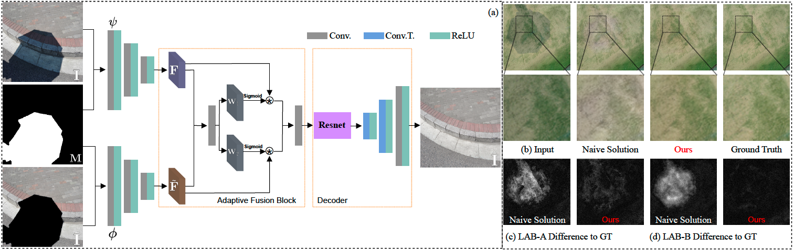

# Leveraging Inpainting for Single-Image Shadow Removal, Accepted by ICCV2023

In this work, we find that pretraining shadow removal networks on the image inpainting dataset can reduce the shadow remnants significantly: a naive encoder-decoder network gets competitive restoration quality w.r.t. the state-of-the-art methods via only 10% shadow & shadow-free image pairs. After analyzing networks with/without inpainting pretraining via the information stored in the weight (IIW), we find that inpainting pretraining improves restoration quality in non-shadow regions and enhances the generalization ability of networks significantly. Additionally, shadow removal fine-tuning enables networks to fill in the details of shadow regions. Inspired by these observations we formulate shadow removal as an adaptive fusion task that takes advantage of both shadow removal and image inpainting. The extensive experiments show that our method empowered with inpainting outperforms all state-of-the-art methods.[[ArXiv]](https://arxiv.org/abs/2302.05361)
<br>
<p align="center">
<a href = "https://#">
    
</a>
<br>
Try our method in Google Colab
</p>



## Prerequisites
- Python 3
- PyTorch >= 1.0
    ```
    conda create -n inpaint4shadow python=3.7

    conda activate inpaint4shadow

    conda install pytorch==1.7.0 torchvision==0.8.0 torchaudio==0.7.0 cudatoolkit=10.1 -c pytorch

    pip install -r requirements.txt
    ```

## Dataset

- [ISTD+](https://github.com/cvlab-stonybrook/SID)
- SRD[(please email the author)](https://people.ucas.edu.cn/~tianjd)

- For data folder path (ISTD+) organize them as following:

  ```shell
    --ISTD+
       --train
          --train_A (shadow images)
              --1.png
              --2.png
              --3.png
          --train_B (ground truth shadow masks)
              --1.png
              --2.png
              --3.png
          --train_C (ground truth)
              --1.png
              --2.png
              --3.png
       --test
          --test_A (shadow images)
              --1.png
              --2.png
              --3.png
          --test_B (ground truth shadow masks)
              --1.png
              --2.png
              --3.png
          --test_B_detected (detected shadow masks)
              --1.png
              --2.png
              --3.png
          --test_C (ground truth)
              --1.png
              --2.png
              --3.png
     ```

- Generate the image list
   ```
   python  ./data/data_list.py
   ```
## Pretrained models
- [ISTD+](https://drive.google.com/drive/folders/1WjEwrSjeF7rBiaVuPQakc3uHGdFyGc5e?usp=sharing)
- [SRD](https://drive.google.com/drive/folders/1WjEwrSjeF7rBiaVuPQakc3uHGdFyGc5e?usp=sharing)

## De-shadowed results
- [ISTD+](https://drive.google.com/drive/folders/1gna_0-ECys93k77bUFCo_9npJ8Av8iqm?usp=sharing)
- [SRD](https://drive.google.com/drive/folders/1gna_0-ECys93k77bUFCo_9npJ8Av8iqm?usp=sharing)
## Training
- #### Inpainting pretraining
  Setup parameters: ./Inpainting_pretraining/checkpoints/config.yml
  ```
  python ./Inpainting_pretraining/train.py
  ```
- #### Shadow removal fine-tuning
  Setup parameters: ./shadow_removal/checkpoints/config.yml
  ```      
  python ./shadow_removal/train.py
  ```  

## Testing
- #### Shadow removal on ISTD+ dataset

1. Downloaded the "ISTD+.pth" and put that under ./shadow_removal/checkpoints.
2. Update "MODEL_LOAD: ISTD+.pth" in ./shadow_removal/checkpoints/config.yml.
3. Update the test dataset path in ./shadow_removal/checkpoints/config.yml. 
    ```
    python ./shadow_removal/test.py 
    ```
- #### Evaluation
1. The RMSE results reported in the paper are calculated by the <a href='https://drive.google.com/file/d/1SAMqLy3dSONPgeC5ZQskPoeq60FEx9Vk/view'>matlab script</a>. Our evaluation code will print the metrics calculated by python code and save the de-shadowed results which will be used by the matlab script.
2. PSNR, SSIM, and LPIPS
    ```
    python ./shadow_removal/Evaluation.py 
    ```
## Results
- Comparsion with SOTA methods


- L1 difference on ISTD+ dataset


- L1 difference on SRD dataset


## Bibtex

```
@article{li2023leveraging,
  title={Leveraging Inpainting for Single-Image Shadow Removal},
  author={Li, Xiaoguang and Guo, Qing and Abdelfattah, Rabab and Lin, Di and Feng, Wei and Tsang, Ivor and Wang, Song},
  journal={arXiv preprint arXiv:2302.05361},
  year={2023}
}
```

[//]: # (## Acknowledgments)

[//]: # (Parts of this code were derived from:<br>)

[//]: # (https://github.com/tsingqguo/efficientderain <br>)

[//]: # (https://github.com/knazeri/edge-connect)
